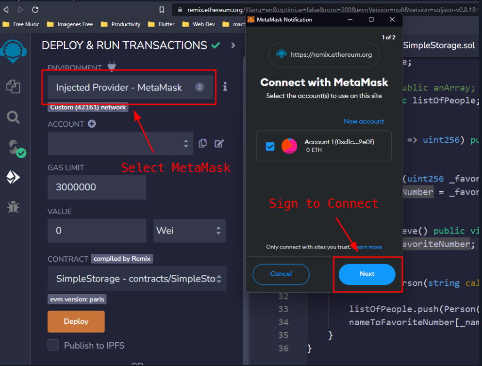

# Deploying your first contract

You can follow along with the video course from here.
Introduction
Over the past eight lessons, we crafted the SimpleStorage contract. It defines a custom type Person, includes an internal variable that can be read and updated, and contains a public array and mapping that can also be modified. In this lesson, we will deploy the contract to a real testnet, which fully simulates a live blockchain environment without using real Ether.

> 🔥 CAUTION
> You could be tempted to immediately deploy this contract to a testnet. As a general rule, I caution against this. Make sure to write tests, carry out audits and ensure the robustness of your contract before deploying it to production. However, for the sake of this demonstration, we're going to deploy this as a dummy contract on a testnet.

Before deploying, be always sure to make a compilation check. This ensures that the contract has no errors or warnings and is fit for deployment.
Deployment on a testnet
We can start the deployment process by going into the deployment tab and switching from the local virtual environment (Remix VM) to the Injected Provider - MetaMask. This action will allow Remix to send requests and interact with your MetaMask account.

You will be then prompted to select an account from your MetaMask wallet. Once you've connected that account to Remix, you should see a confirmation that the account is properly linked and that you are using the Sepolia testnet.

Ensure you have enough Sepolia ETH in your account, which you can obtain from a faucet. Once your balance is sufficient, you can proceed by clicking the "Deploy" button.
After that, MetaMask will ask to sign and send the transaction on the testnet.

Once the transaction is executed, the contract address will be listed under deployed contracts, along with the transaction details. This is how the deployment transaction is displayed on Etherscan.

Contract interaction
Since the contract has been deployed, we can now interact with it and update the blockchain. For example, if you want to store a number, you can do so by clicking the button 'store': MetaMask will ask for another transaction confirmation, that will update the favorite number. We can check the details on etherscan at the deployed address:

> 👀❗IMPORTANT
> View and pure functions will not send transactions

> 💡 TIP
> Celebrate small victories and milestones. These psychological boosts will keep you engaged in the learning process.

It's possible to deploy a contract to different testnets or a real mainnet, just by switching the Metamask network. Be sure to have enough net-compatible ETHs to deploy your contract.
Conclusion
Deploying a Solidity contract to a testnet is a crucial step in the development process, allowing you to test its functionality in a live blockchain environment without the risk of using real Ether. Always remember to perform necessary audits and tests to confirm the contract's safety and correctness before deployment.

🧑‍💻 Test yourself

- 📕 What steps should you take before deploying a contract to a testnet?
- 🧑‍💻 Deploy one simple Solidity contract to the Sepolia testnet. Which important information can you see on etherscan?

## Zksync Deploying

Introduction
With the rising costs of deploying to the Ethereum mainnet, scaling solutions like roll-ups and Layer 2 networks are increasingly in demand. The following lessons will guide you through deploying a smart contract to L2 zkSync. If you've followed the zkSync lessons on the Blockchain Basics section, you should have already added ZK-Sync to your Metamask. If not, we'll walk through that process in the next lesson.
Testnet Funds
To deploy contracts on zkSync, you'll need testnet funds. There are two methods to obtain them:

- zkSync Faucet: similar to using a Sepolia faucet, this method allows you to request testnet funds directly.
- zkSync Bridge: this method involves transferring funds from Ethereum testnet to zkSync testnet. While free faucets can sometimes be unreliable, bridging offers a more consistent solution.

Deploying
To deploy a contract to ZK-Sync, there are a few key steps to follow. First, it's crucial to configure zkSync in your Metamask wallet. Next, you'll need to acquire testnet ETH, which is necessary for deploying and testing your contract.
