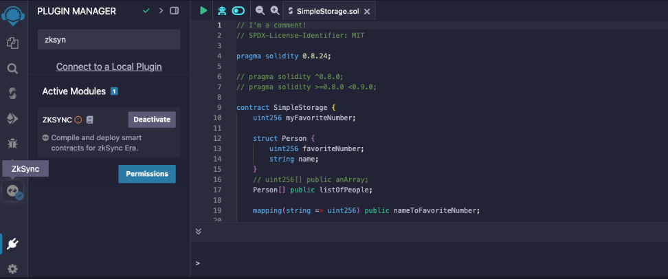
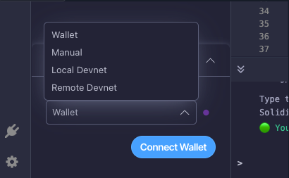

# Zksync Plugin

Introduction
In this lesson, you're about to learn the same type of layer 2 or rollup deployment that professional developers are using. On Remix, we can start by activating the zkSync plugin in our environment. In the plugin manager, search for "zkSync" and activate the zkSync module. You'll notice that a new zkSync tab on the left side will appear.

This module is made of sections for compiling, deploying, and interacting with contracts on zkSync.
Compiling
Let's start by compiling the SimpleStorage.sol file by hitting the "Compile" button.

> 👀❗IMPORTANT
> Ensure that the Solidity Compiler Version in the contract matches the [zkSync compiler requirements](https://github.com/Cyfrin/foundry-full-course-cu?tab=readme-ov-file#zksync-l2-deploy). As of this recording, the required version is 0.8.24.

Deploying
After compilation, you can go to the environment tab to connect your MetaMask wallet, ensuring it is set to the zkSync Sepolia testnet. Once connected, you can deploy and verify the SimpleStorage contract.

Verifying Deployment
After hitting the deploy button, MetaMask will request a signature. Approve it, and after a short delay, a detailed output will appear indicating the deployment status. If the terminal output shows a green "verification successful" message, it means that your contract has been both deployed and verified correctly.
Checking the Deployment
To check our deployment, you can copy the contract address and paste it into the zksync Sepolia explorer. Here, you can view the contract details.

> 👀❗IMPORTANT
> At the moment of recording, the zkSync plugin contains a minor bug. Please refer to lesson 14.

Conclusion
Well done! You've successfully deployed a smart contract to the zkSync testnet, marking a notable achievement and a significant step forward in your development journey.
